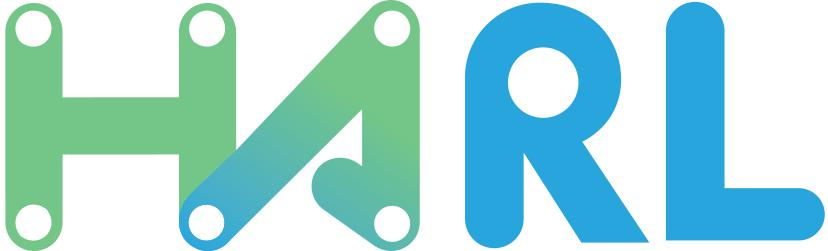
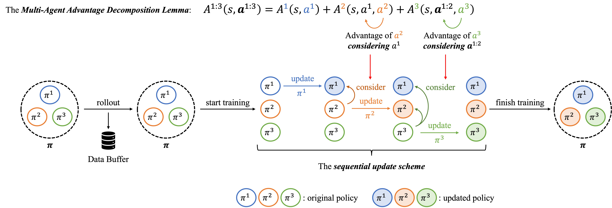
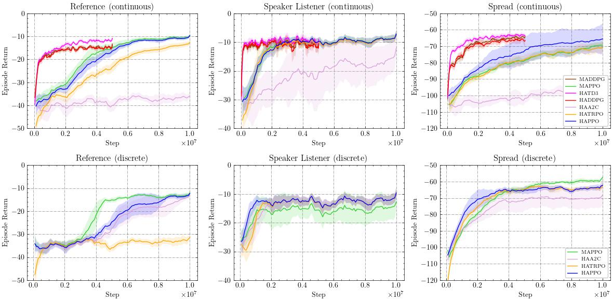
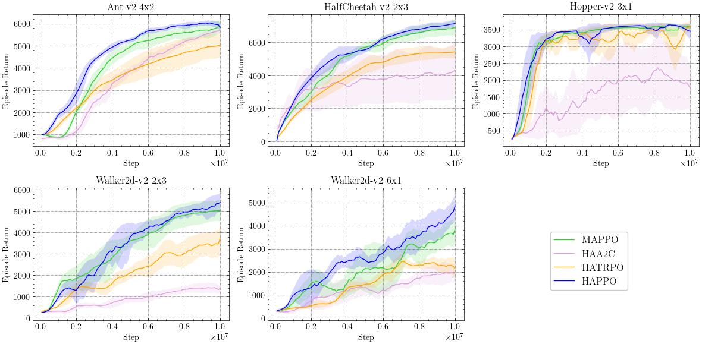
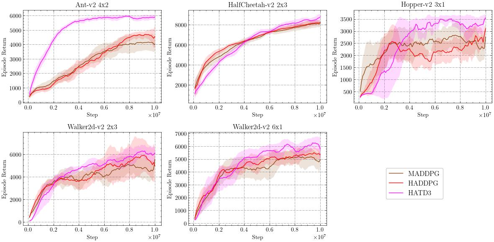
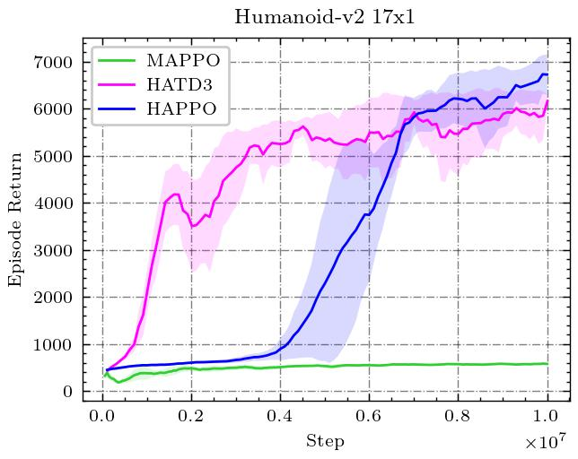
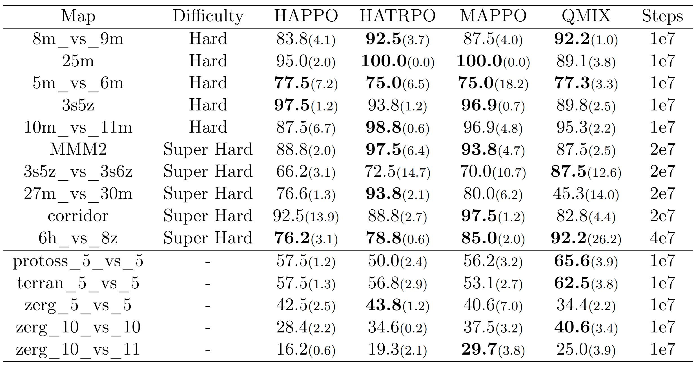
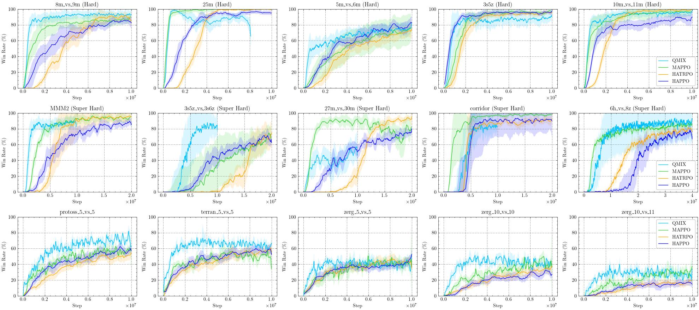
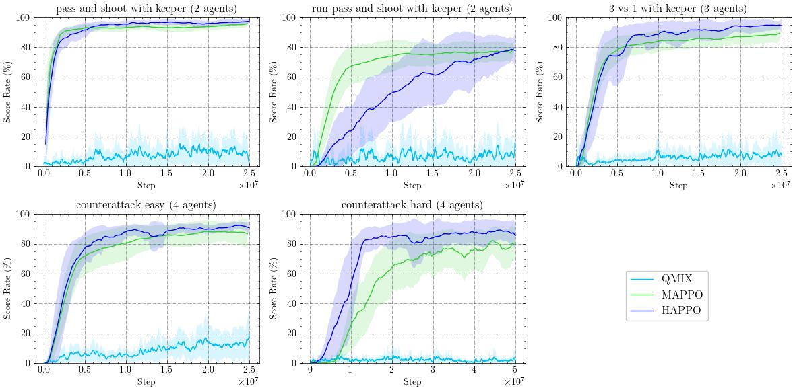
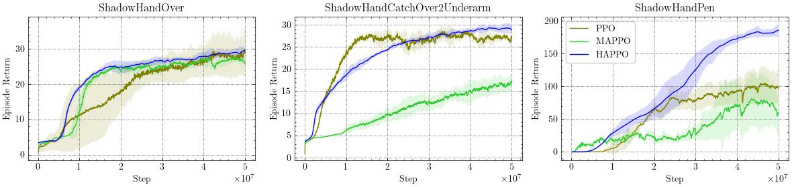

<div align="center">
  
</div>

<h1 align="center"> Heterogeneous-Agent Reinforcement Learning </h1>

This repository contains the **official implementation** of **Heterogeneous-Agent Reinforcement Learning (HARL)** algorithms, including **HAPPO**, **HATRPO**, **HAA2C**, **HADDPG**, **HATD3**, **HAD3QN**, and **HASAC**, based on PyTorch. ***HARL algorithms are markedly different from MAPPO in that they are generally applicable to heterogeneous agents and are supported by rigorous theories, often achieving superior performance.*** This repository allows researchers and practitioners to easily reproduce our results on seven challenging benchmarks or apply HARL algorithms to their intended applications.


## Overview

HARL algorithms are our novel solutions to achieving effective multi-agent cooperation in the general *heterogeneous-agent* settings, without relying on the restrictive *parameter-sharing* trick. 

### Key features

- HARL algorithms achieve coordinated agent updates by employing the *sequential update scheme*, different from the *simultaneous update scheme* utilized by MAPPO and MADDPG.
- HARL algorithms enjoy theoretical guarantees of **monotonic improvement** and **convergence to equilibrium**, ensuring their efficacy in promoting cooperative behavior among agents.
- Both on-policy and off-policy HARL algorithms, exemplified by **HAPPO** and **HASAC** respectively, demonstrate superior performance across a wide range of benchmarks.

The following figure is an illustration of the *sequential update scheme*
<div align="center">
  
</div>

For more details, please refer to our [HARL](https://jmlr.org/papers/v25/23-0488.html) (JMLR 2024) and [MEHARL](https://openreview.net/forum?id=tmqOhBC4a5) (ICLR 2024 spotlight) papers.


## Installation

### Install HARL

```shell
conda create -n harl python=3.8
conda activate harl
# Install pytorch>=1.9.0 (CUDA>=11.0) manually
git clone https://github.com/PKU-MARL/HARL.git
cd HARL
pip install -e .
```


### Install Environments Dependencies

Along with HARL algorithms, we also implement the interfaces for seven common environments ([SMAC](https://github.com/oxwhirl/smac), [SMACv2](https://github.com/oxwhirl/smacv2), [MAMuJoCo](https://github.com/schroederdewitt/multiagent_mujoco), [MPE](https://pettingzoo.farama.org/environments/mpe/), [Google Research Football](https://github.com/google-research/football), [Bi-DexterousHands](https://github.com/PKU-MARL/DexterousHands), [Light Aircraft Game](https://github.com/liuqh16/CloseAirCombat)) and they can be used directly. (We also implement the interface for [Gym](https://www.gymlibrary.dev/). Gym is a single-agent environment, which can be seen as a special case of multi-agent environments. It is included mainly for reference purposes.) You may choose to install the dependencies to the environments you want to use.

**Install Dependencies of Bi-DexterousHands**

Bi-DexterousHands depend on IsaacGym. The hardware requirements of IsaacGym has to be satisfied. To install IsaacGym, download IsaacGym Preview 4 release from [its official website](https://developer.nvidia.com/isaac-gym/download). Then run `pip install -e .` under its `python` folder.

**Install Light Aircraft Game**

[Light Aircraft Game](https://github.com/liuqh16/CloseAirCombat) (LAG) is a recently developed cooperative-competitive environment for red and blue aircraft games, offering various settings such as single control, 1v1, and 2v2 scenarios. In the context of multi-agent scenarios, LAG currently supports self-play only for 2v2 settings. To address this limitation, we introduce novel cooperative non-weapon and shoot-missile tasks where two agents collaborate to combat two opponents controlled by the built-in AI. In the non-weapon task, agents are trained to fly towards the opponents' tails while maintaining a suitable distance. In the shoot-missile task, agents learn to dodge opponent missiles and launch their own missiles to destroy the opponents.

To install LAG, run the following command:
```shell
# Install dependencies
pip install torch pymap3d jsbsim==1.1.6 geographiclib gym==0.21.0 wandb icecream setproctitle
# Initialize submodules(*JSBSim-Team/jsbsim*)
git submodule init
git submodule update
```

**Install Google Research Football**

Please follow [the official instructions](https://github.com/google-research/football) to install Google Research Football.

**Install SMAC**

Please follow [the official instructions](https://github.com/oxwhirl/smac) to install SMAC. We use StarCraft II version 4.10 on Linux.

**Install SMACv2**

Please follow [the official instructions](https://github.com/oxwhirl/smacv2) to install SMACv2.

**Install MPE**

```shell
pip install pettingzoo==1.22.2
pip install supersuit==3.7.0
```

**Install Gym Suite (Except MuJoCo)**

```shell
# Install gym
pip install gym
# Install classic control
pip install gym[classic_control]
# Install box2d
conda install -c anaconda swig
pip install gym[box2d]
# Install atari
pip install --upgrade pip setuptools wheel
pip install opencv-python
pip install atari-py
pip install gym[atari]
pip install autorom[accept-rom-license]
```

**Install MuJoCo**

First, follow the instructions on https://github.com/openai/mujoco-py, https://www.roboti.us/, and https://github.com/deepmind/mujoco to download the right version of mujoco you need.

Second, `mkdir ~/.mujoco`.

Third, move the .tar.gz or .zip to `~/.mujoco`, and extract it using `tar -zxvf` or `unzip`.

Fourth, add the following line to the `.bashrc`:

```shell
export LD_LIBRARY_PATH=$LD_LIBRARY_PATH:/home/<user>/.mujoco/<folder-name, e.g. mujoco210, mujoco-2.2.1>/bin
```

Fifth, run the following command:

```shell
sudo apt install libosmesa6-dev libgl1-mesa-glx libglfw3
pip install mujoco
pip install gym[mujoco]
sudo apt-get update -y
sudo apt-get install -y patchelf
```

**Install Dependencies of MAMuJoCo**

First follow the instructions above to install MuJoCo. Then run the following commands.

```shell
pip install "mujoco-py>=2.1.2.14"
pip install "Jinja2>=3.0.3"
pip install "glfw>=2.5.1"
pip install "Cython>=0.29.28"
```

Note that [mujoco-py](https://github.com/openai/mujoco-py) is compatible with `mujoco210` (see [this](https://github.com/openai/mujoco-py#install-mujoco)). So please make sure to download `mujoco210` and extract it into the right place.


### Solve Dependencies

After the installation above, run the following commands to solve dependencies.

```shell
pip install gym==0.21.0
pip install pyglet==1.5.0
pip install importlib-metadata==4.13.0
```

If you encounter issues when using `pip install gym==0.21.0`, try using the following command instead:

```
conda install -c conda-forge gym=0.21.0
```


## Usage

### Training on Existing Environments

To train an algorithm on a provided environment, users can modify yaml configuration files of the corresponding algorithm and environment under `harl/configs/algos_cfgs` and `harl/configs/envs_cfgs` as they wish, go to `examples` folder, and then start training with a one-liner `python train.py --algo <ALGO> --env <ENV> --exp_name <EXPERIMENT NAME>` or `python train.py --load_config <CONFIG FILE PATH> --exp_name <EXPERIMENT NAME>`, where the latter is mostly used when reproducing an experiment. We provide the **tuned configurations** for algorithms in each environments under `tuned_configs` folder. Users can **reproduce our results** by using `python train.py --load_config <TUNED CONFIG PATH> --exp_name <EXPERIMENT NAME>` and change `<TUNED CONFIG PATH>` to the absolute path of the tuned config file on their machine.

During training, users receive continuous logging feedback in the terminal.

After training, users can check the log file, tensorboard output, experiment configuration, and saved models under the generated `results` folder. Moreover, users can also render the trained models by setting `use_render: True`, `model_dir: <path to trained models>` in algorithm configuration file (for football users also need to set `render: True` in the environment configuration file), and use the same training command as above again. For SMAC and SMACv2, rendering comes in the form of video replay automatically saved to the `StarCraftII/Replays` folder (more details can be found [here](https://github.com/oxwhirl/smac#saving-and-watching-starcraft-ii-replays)).

To enable batch running, we allow users to modify yaml configs in the command line. For each training command, users specify the special parameters in the commands with the same names as in the config files. For example, if you want to run HAPPO on SMAC tasks under three random seeds. You can customize the configs and replace `train.sh` with the following commands:

```shell
for seed in $(seq 1 3)
do
	python train.py --algo happo --env smac --exp_name test --seed $seed
done
```


### Applying to New Environments

If you want to apply HA series algorithms to solve new tasks, you need to implement environment interfaces, following the examples of the seven environments provided. A simplest interface may look like:

```python
class Env:
    def __init__(self, args):
        self.env = ...
        self.n_agents = ...
        self.share_observation_space = ...
        self.observation_space = ...
        self.action_space = ...

    def step(self, actions):
        return obs, state, rewards, dones, info, available_actions

    def reset(self):
        return obs, state, available_actions

    def seed(self, seed):
        pass

    def render(self):
        pass

    def close(self):
        self.env.close()
```

The purpose of interface is to *hide environment-specific details and expose a unified interaction protocol, so that other modules could process data uniformly*.

You may also want to produce continuous logging output during training. If you intend to use an on-policy algorithm, you need to implement a logger for your environment. The simplest logger can inherit from `BaseLogger` in `harl/common/base_logger.py` and implement the `get_task_name` function. More customised logging requirements can be fulfilled by extending or overriding more functions. We recommend referring to the existing loggers in each environment directory to get to know how it is written. If an off-policy algorithm is used, you can directly customise logging by modifying the off-policy runner code. In the end, please register the logger (if any), add a yaml config file, and add necessary code to `examples/train.py`, `harl/utils/configs_tool.py`, and `harl/utils/envs_tool.py`. Again, following the existing seven environment examples will be convenient.

After these steps, you can apply the algorithms immediately as above.


### Application Scope of Algorithms

|        | Continuous action space | Discrete action space | Multi Discrete action space |
| :----: | :---------------------: | :-------------------: | :-------------------------: |
| HAPPO  |            √            |           √           |              √              |
| HATRPO |            √            |           √           |                             |
| HAA2C  |            √            |           √           |              √              |
| HADDPG |            √            |                       |                             |
| HATD3  |            √            |                       |                             |
| HAD3QN |                         |           √           |                             |
| HASAC  |            √            |           √           |              √              |
| MAPPO  |            √            |           √           |              √              |
| MADDPG |            √            |                       |                             |
| MATD3  |            √            |                       |                             |


## Performance on Cooperative MARL Benchmarks

### MPE

<div align="center">
  
</div>

### MAMuJoCo

HAPPO, HADDPG, and HATD3 outperform MAPPO, MADDPG, and MATD3; HAPPO and HATD3 are the most effective methods for heterogeneous-agent cooperation tasks.

<div align="center">
  
</div>

<div align="center">
  
</div>
<div align="center">
  
</div>

### SMAC & SMACv2

HAPPO and HATRPO are comparable to or better than MAPPO and QMIX in SMAC and SMACv2, demonstrating their capability in mostly homogeneous-agent settings.

<div align="center">
  
</div>

<div align="center">
  
</div>

### GRF

HAPPO consistently outperforms MAPPO and QMIX on GRF, and the performance gap increases as the number and heterogeneity of agents increase.

<div align="center">
  
</div>
<div align="center">
  
</div>

### Bi-DexterousHands

HAPPO consistently outperforms MAPPO, and is also better than the single-agent baseline PPO, while also showing less variance.

<div align="center">
  
</div>

*The experiment results of HASAC can be found at https://sites.google.com/view/meharl*

## Citation

This repository is affiliated with [Peking University](https://www.pku.edu.cn//) and [BIGAI](https://www.bigai.ai/). If you find our paper or this repository helpful in your research or project, please consider citing our works using the following BibTeX citation:

```tex
@article{JMLR:v25:23-0488,
  author  = {Yifan Zhong and Jakub Grudzien Kuba and Xidong Feng and Siyi Hu and Jiaming Ji and Yaodong Yang},
  title   = {Heterogeneous-Agent Reinforcement Learning},
  journal = {Journal of Machine Learning Research},
  year    = {2024},
  volume  = {25},
  number  = {32},
  pages   = {1--67},
  url     = {http://jmlr.org/papers/v25/23-0488.html}
}
```

```tex
@inproceedings{
liu2024maximum,
title={Maximum Entropy Heterogeneous-Agent Reinforcement Learning},
author={Jiarong Liu and Yifan Zhong and Siyi Hu and Haobo Fu and QIANG FU and Xiaojun Chang and Yaodong Yang},
booktitle={The Twelfth International Conference on Learning Representations},
year={2024},
url={https://openreview.net/forum?id=tmqOhBC4a5}
}
```
